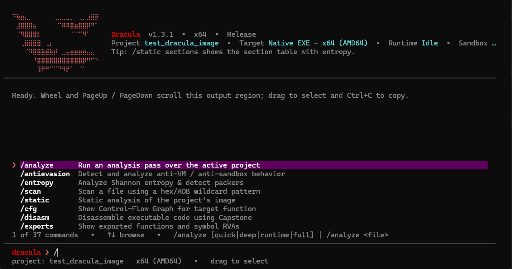

# Dracula

Open-source, local-first reverse engineering and runtime analysis for Windows.

Dracula keeps static analysis, live processes, loaded modules, memory, runtime
telemetry, emulation, isolated VM execution, artifacts, and reports attached to
one persistent project. The goal is not to hide specialist tools. It is to stop
the target context from being lost every time an investigation moves between
them.

Windows x64 · C++20 · GPL-3.0-only · Local-first · AI optional



> **ONE PROJECT. ONE TARGET CONTEXT. ONE EVIDENCE MODEL.**

## Why Dracula?

Reverse engineering frequently requires moving the same target between a
parser, debugger, memory viewer, dump reconstruction tool, emulator, sandbox,
and a collection of scripts. Each handoff loses context: addresses need to be
rebased again, artifacts become detached from the operation that produced
them, and live observations have to be correlated manually with static data.

Traditional workflow:

```text
 EXE
  │
  ▼
Debugger ──► Dump ──► Disassembler ──► Emulator ──► Sandbox
                                                    │
                                                    ▼
                                           Manual correlation
```

Dracula:

```text
                    Project
                       │
             ┌─────────┼─────────┐
             ▼         ▼         ▼
          Static     Memory    Runtime
             \         │         /
              \        │        /
               └─── Evidence ───┘
                       │
                 ┌─────┴─────┐
                 ▼           ▼
               QEMU         MCP
```

A dump is still useful when an investigation needs one. Dracula treats it as
an artifact of the project rather than making it the prerequisite for every
static-to-live correlation.

## One target, one workspace

`ProjectContext` is the durable center of the workflow. Attaching to Notepad,
for example, can bind the process ID, the resolved `notepad.exe`, loaded
modules, their on-disk files, module bases, static RVAs, live virtual addresses,
memory snapshots, runtime events, and generated reports to the same project.

For a loaded DLL, the relationship is explicit:

```text
on-disk DLL
     ↕
loaded module
     ↕
static RVA ↔ live VA
     ↕
live process memory
```

Dracula labels what it can establish. Address correlation uses `STATIC`,
`RESOLVED`, and `LIVE-READ VERIFIED`; evidence-graph conclusions use
`Observed`, `Inferred`, `Suspected`, or `Unknown`. A live-read label is emitted
only after the corresponding process read succeeds. These labels describe how
evidence was obtained; they are not a claim of complete cryptographic
provenance.

## Core capabilities

### Static analysis

- Bounds-checked PE metadata, sections, data directories, imports, and exports
- ASCII and UTF-16 strings, entropy, packer indicators, and mitigations
- x86/x64 disassembly through Capstone
- Function indexing, control-flow graphs, and cross-references
- Symbol resolution where the target and available Windows symbol services
  permit it

### Live process analysis

- Read-only attachment to an authorized process
- Backing-executable resolution and a project-owned copy for later static work
- Module, thread, and virtual-memory maps
- Bounded memory reads, snapshots, and snapshot comparison
- Runtime status and event timelines through available Windows backends

### DLL intelligence

Dracula correlates an on-disk DLL with a module loaded in the active process.
Exports and functions remain expressed as RVAs for static work, while the
loaded base supplies a live VA. A successful process-memory read can then raise
the correlation from `RESOLVED` to `LIVE-READ VERIFIED`.

### Runtime and evidence

Application services write structured results, artifacts, and event records to
the active project. ETW, DbgHelp-based process inspection, the optional x64
agent, emulation, and QEMU telemetry contribute observations without forcing
the terminal UI to own analysis logic. Large tables are written as local,
self-contained HTML reports instead of flooding scrollback.

### Emulation

Unicorn provides bounded x86/x64 CPU emulation. Dracula adds Win32 HLE and
environment profiles for controlled analysis, including differential
anti-evasion experiments. Emulation models selected behavior; it is not a full
Windows operating system.

### Isolated VM analysis

QEMU sessions use an immutable restored base and disposable qcow2 overlays.
The GuestAgent associates telemetry with the owning project and session. QEMU
is lazy: opening a project does not boot a VM, and a runtime analysis request is
not automatically the same operation as an explicit sandbox run.

### Managed code

The out-of-process .NET host inspects assembly metadata, types, methods,
strings, IL bodies, and P/Invoke declarations. Managed inspection requires the
.NET 10 runtime. Offline assemblies do not expose live memory or threads.

### Drivers

Windows driver targets receive static PE, import, section, function, and
mitigation analysis. Live kernel execution is not performed on the host;
runtime investigation requires the isolated QEMU path and an appropriately
configured guest.

### MCP

Dracula includes a stdio Model Context Protocol server. Dracula remains useful
without AI:

```text
Dracula alone              → analysis platform
Dracula + MCP-compatible AI → external reasoning/orchestration layer
```

An MCP client can query the same structured project and evidence state instead
of receiving disconnected dumps, screenshots, addresses, and logs. The client
and any external provider determine what data leaves the machine; Dracula does
not upload targets automatically. See [MCP integration](docs/mcp.md).

## Install

Open PowerShell. The bootstrap resolves the latest public Windows x64 release,
requires its SHA-256 sidecar, verifies the archive, asks for an installation
location with real free-space figures, creates the workspace, and adds `drac`
to the per-user PATH.

```powershell
irm https://raw.githubusercontent.com/i87kai/Dracula/main/scripts/bootstrap.ps1 | iex
```

No Administrator privileges are required for the default per-user location.
Open a fresh terminal after installation:

```powershell
drac
```

### Manual release installation

1. Download the Windows x64 ZIP and matching `.sha256` file from the
   [latest release](https://github.com/i87kai/Dracula/releases/latest).
2. Verify the archive before extracting it:

   ```powershell
   $zip = Get-Item .\Dracula-v*-windows-x64.zip
   $expected = ((Get-Content "$($zip.FullName).sha256" -Raw) -split '\s+')[0]
   $actual = (Get-FileHash $zip.FullName -Algorithm SHA256).Hash
   if ($actual -ne $expected) { throw 'SHA-256 verification failed' }
   Expand-Archive $zip.FullName -DestinationPath .\Dracula
   & .\Dracula\scripts\install.ps1
   ```

Repair, update, uninstall, PATH behavior, and supported PowerShell policy
alternatives are covered in [Installation](docs/installation.md).

## Quick start: inspect Notepad

Start Notepad, then launch `drac`. Choose **Attach to Process**, or use the
command prompt:

```text
/process list
/process attach <notepad-pid>
/target info
/static
/process modules
/memory map
/runtime status
/dll windowscodecs.dll
```

`/process attach` creates or reopens a project, resolves and copies the backing
executable, and keeps later static commands attached to that process context.
The DLL command demonstrates static-to-live module correlation when the named
module is loaded. Run `/help <command>` for accepted syntax and see the
[CLI reference](docs/cli.md) for the complete command index.

## Project layout

A typical workspace is deliberately inspectable on disk:

```text
projects/
  sample_<id>/
    project.json
    original/
    static/
    functions/
    modules/
    memory/
      maps/
      snapshots/
      dumps/
    runtime/
    sandbox/
    reports/
    artifacts/
    logs/
    overlays/
    cache/
```

`project.json` stores portable project metadata and target identity. The
original sample copy, retained evidence, and reports survive cleanup; disposable
dumps, overlays, and cache entries can be reclaimed separately. See
[Projects and persistence](docs/projects.md).

## `.draculaimg` and user-owned Windows environments

Dracula can package a locally supplied Windows analysis environment as
`windows10.draculaimg`. The format is streamed and Zstandard-compressed, keeps
per-chunk CRC-32 values, and records a SHA-256 digest of the restored content.
Dracula verifies the package, restores an operational immutable base, gives
each QEMU run a temporary overlay, and cleans orphaned overlays without
removing one owned by a live QEMU process.

Dracula does **not** ship Windows, a Windows product key, or a VM image. The
repository and release archives contain no `.draculaimg`. Users must provide
appropriately licensed local installation media or an existing environment.
See [the format](docs/draculaimg.md) and [sandbox setup](docs/sandbox.md).

## Local-first by design

Static analysis, process inspection, memory analysis, QEMU execution, projects,
and reports run locally. Project data remains under the selected installation
root. Dracula does not require a cloud account and does not automatically
upload binaries, memory, or reports.

MCP is an explicit integration boundary. If a client forwards Dracula results
to a local or remote model, that client's configuration and provider policy
govern the transfer.

## Architecture

```text
┌──────────────────────────────────────────────┐
│                 Dracula Core                 │
│ PE · UTR · Memory · Functions · Evidence     │
│ Unicorn · QEMU · Runtime backends             │
└──────────────────────┬───────────────────────┘
                       │ structured DTOs
┌──────────────────────▼───────────────────────┐
│             Application Services             │
│ Project · Target · Static · Process · Memory │
│ DLL · Runtime · Sandbox · Update             │
└──────────────────────┬───────────────────────┘
                       │
                 ┌─────┴─────┐
                 ▼           ▼
                CLI         MCP
                 │
                 └── future local web frontend
```

The CLI formats service results; it does not duplicate PE, memory, project, or
runtime logic. A future local web frontend is planned for CFGs, call graphs,
large tables, memory maps, timelines, project browsing, evidence relationships,
and QEMU state. No web framework or Skills runtime is included today.

## Documentation

- [Getting started](docs/getting-started.md)
- [Installation, repair, update, and uninstall](docs/installation.md)
- [Architecture and evidence terminology](docs/architecture.md)
- [Projects and persistence](docs/projects.md)
- [CLI reference](docs/cli.md)
- [QEMU sandbox](docs/sandbox.md)
- [`.draculaimg` format](docs/draculaimg.md)
- [MCP integration](docs/mcp.md)
- [Build from source](docs/building.md)
- [Troubleshooting](docs/troubleshooting.md)
- [Roadmap](docs/roadmap.md)
- [Release history](CHANGELOG.md)

The repository's [`skills/`](skills/) directory documents a future,
provider-neutral Skills architecture: operational knowledge, evidence
interpretation, decision procedures, and analysis playbooks. Skills are
planned to reduce trial and error; they will not change a model's fundamental
capability. The planned packaged location is `<install>\brain\skills\`.

## Current limitations

- Host and packaged CLI support is Windows x64; the in-process agent is x64
  only.
- Process inspection and symbols use Win32 and DbgHelp today. DbgEng execution
  control remains partial/optional rather than a full debugger frontend.
- Service target adapters exist, but service-first project creation is not yet
  fully wired into the project-centric CLI.
- Driver runtime observation requires a configured QEMU guest; host analysis is
  static.
- Managed metadata inspection requires the .NET 10 runtime.
- QEMU analysis requires QEMU, a user-provided licensed Windows environment,
  and GuestAgent provisioning. CI exercises orchestration with synthetic
  fixtures; a real guest is environment-dependent.
- `/analyze runtime` selects runtime backends under the active safety policy;
  `/sandbox` is the explicit QEMU environment and image-management workflow.

Planned and experimental work is separated from implemented behavior in the
[roadmap](docs/roadmap.md).

## Build from source

Clone the pinned dependencies, configure, build, and test:

```powershell
git clone --recurse-submodules https://github.com/i87kai/Dracula.git
cd Dracula
cmake -S . -B build -G "MinGW Makefiles" -DCMAKE_BUILD_TYPE=Release
cmake --build build --parallel 4
ctest --test-dir build --output-on-failure
```

The .NET 10 SDK builds the managed-analysis host; Git for Windows supplies the
small POSIX configuration tools used by Unicorn's MinGW build. MSVC and full
prerequisites are documented in [Building](docs/building.md).

## Security and responsible use

Use Dracula only on systems and software you own or are authorized to analyze.
Report vulnerabilities through the private process in [SECURITY.md](SECURITY.md).
Do not attach confidential binaries, proprietary dumps, memory captures,
credentials, or private samples to public issues.

## Contributing

Contributions are welcome. Read [CONTRIBUTING.md](CONTRIBUTING.md) and the
[Code of Conduct](CODE_OF_CONDUCT.md). Preserve the dependency direction
**Core → Application Services → Frontends**: analysis and persistence logic
belongs below the CLI and MCP adapters, not in presentation handlers.

## License

Dracula is licensed under [GNU GPL v3.0 only](LICENSE). Dependency attribution,
purposes, licenses, and integration modes are recorded in
[THIRD_PARTY_NOTICES.md](THIRD_PARTY_NOTICES.md).
